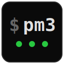

<p align="center"></p>

# pm3

A process manager. Define processes in `pm3.toml`, manage them with simple commands.

[](https://asciinema.org/a/4Kat5eEd2jJPxTaz)

## Installation

### macOS / Linux

```sh
curl --proto '=https' --tlsv1.2 -LsSf https://github.com/frectonz/pm3/releases/latest/download/pm3-installer.sh | sh
```

### Windows

```powershell
powershell -ExecutionPolicy ByPass -c "irm https://github.com/frectonz/pm3/releases/latest/download/pm3-installer.ps1 | iex"
```

## Quick Start

Create a `pm3.toml` in your project directory (or run `pm3 init` to generate one interactively):

```toml
[web]
command = "node server.js"
cwd = "./frontend"
env = { PORT = "3000" }

[worker]
command = "python worker.py"
restart = "on_failure"
max_restarts = 10
depends_on = ["web"]
```

Then start your processes:

```sh
pm3 start
```

A background daemon is started automatically and manages your processes.

## Commands

```sh
pm3 start [names...]             # start all or specific processes
pm3 start --env production       # start with environment-specific config
pm3 stop [names...]              # stop all or specific processes
pm3 restart [names...]           # restart all or specific processes
pm3 reload [names...]            # zero-downtime reload (requires health_check)
pm3 list                         # show process table (alias: view)
pm3 info <name>                  # show detailed info about a process
pm3 log [name]                   # view logs (default: last 15 lines)
pm3 log <name> --lines 50 -f     # tail 50 lines and follow
pm3 flush [names...]             # clear log files
pm3 signal <name> <signal>       # send a signal to a process (e.g. SIGHUP)
pm3 save                         # save current process list for resurrection
pm3 resurrect                    # restore previously saved processes
pm3 startup                      # install system service for boot auto-start
pm3 unstartup                    # remove system service
pm3 tui                          # open interactive terminal UI
pm3 init                         # interactive pm3.toml creation wizard
pm3 kill                         # stop everything and shut down the daemon
pm3 --version                    # show version information
```

Add `--json` to any command for JSON output.

## Configuration

All fields except `command` are optional.

```toml
[web]
command = "node server.js"

# Working directory and environment
cwd = "./frontend"
env = { PORT = "3000", NODE_ENV = "production" }
env_file = ".env"                   # or [".env", ".env.local"]

# Restart behavior
restart = "on_failure"              # "on_failure", "always", or "never"
max_restarts = 10                   # max restart attempts before giving up (default: 15)
min_uptime = 1000                   # ms — resets restart counter if process stays up this long (default: 1000)
stop_exit_codes = [0, 143]          # exit codes that should NOT trigger a restart

# Health checks
health_check = "http://localhost:3000/health"  # HTTP, HTTPS, or tcp://host:port

# Graceful shutdown
kill_signal = "SIGTERM"             # signal sent on stop
kill_timeout = 5000                 # ms before SIGKILL after kill_signal

# Resource limits
max_memory = "512M"                 # restart when memory exceeds this (supports K/KB, M/MB, G/GB)

# File watching
watch = true                        # or a path like "./src"
watch_ignore = ["node_modules", ".git"]

# Dependencies and groups
depends_on = ["db", "cache"]        # start after these processes are running
group = "backend"                   # group name for batch operations

# Cluster mode
instances = 4                       # spawn N instances of this process

# Lifecycle hooks
pre_start = "npm run migrate"       # run before the process starts
post_stop = "echo stopped"          # run after the process stops

# Scheduled restart
cron_restart = "0 3 * * *"          # cron expression for periodic restart

# Logging
log_date_format = "%Y-%m-%d %H:%M:%S"
```

### Environment-Specific Config

Override environment variables per deployment environment:

```toml
[web]
command = "node server.js"
env = { PORT = "3000" }

[web.env_production]
DATABASE_URL = "postgres://prod/db"
API_KEY = "prod-key"

[web.env_staging]
DATABASE_URL = "postgres://staging/db"
```

Activate with `pm3 start --env production`.

### Cluster Mode

Run multiple instances of the same process:

```toml
[worker]
command = "python worker.py"
instances = 4
```

This spawns `worker:0` through `worker:3`, each with `PM3_INSTANCE_ID` and `PM3_INSTANCE_COUNT` environment variables. Manage all instances at once (`pm3 stop worker`) or individually (`pm3 stop worker:2`).

## License

MIT
